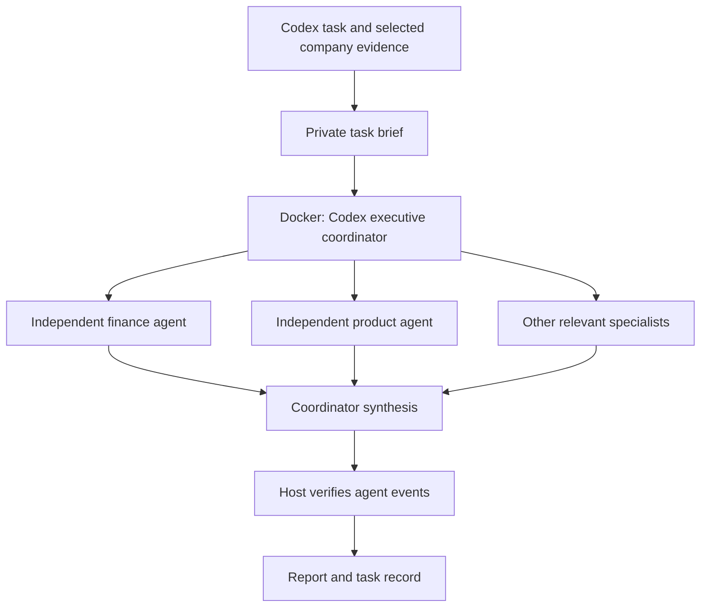

# Open Executive ? Codex Council fork

This fork adds a **Codex executive council running in Docker**: one coordinator
spawns independent specialist agents, waits for their findings, and returns a
single recommendation. It uses a dedicated ChatGPT/Codex sign-in, so this council
mode needs **no separate Anthropic or OpenAI API key**.

Based on [SenteLabsAI/OpenExecutive](https://github.com/SenteLabsAI/OpenExecutive).
The original README is preserved unchanged in [README.upstream.md](README.upstream.md).

## What changed

- Added the installable [open-executive-council skill](skills/open-executive-council/SKILL.md).
- Reused the nine upstream specialist prompts: strategy, finance, people, legal,
  operations, marketing, product, sales, and board communications.
- Added a Docker runtime with pinned Codex CLI 0.154.0 and a pinned Node base image.
- Added a small Python runner using only the standard library. It starts one
  council per task, limits concurrency, enforces a timeout, and checks recorded
  agent spawns and completions before accepting the final report.
- Added tests for incomplete or fabricated councils, stale results, forbidden
  actions, cancellation cleanup, and container ownership; added a Docker CI job.
- Replaced this README and archived the upstream version.

The original FastAPI application and dashboard remain available through the
upstream instructions. **This addition is a separate council workflow; it does
not replace the model provider behind the original application's `/chat` route.**
Its database, document retrieval, integrations, and scheduler are not part of
this council mode.

## Architecture



Specialists get separate contexts and the same relevant brief. The coordinator
collects each first assessment independently, then reconciles disagreements.
Up to three specialists run concurrently; finished agents are closed before
additional roles start. Docker isolates the worker runtime and tools; model
inference remains remote and consumes your Codex account allowance.

## Run locally

Requires Docker and Python 3.10 or newer. From this repository checkout:

```sh
python skills/open-executive-council/scripts/council.py build
python skills/open-executive-council/scripts/council.py login
```

Complete the official device sign-in shown by the second command. The worker
uses its own Docker authentication volume, `open-executive-council-auth`.
Credentials are never included in this repository or container image. Do not
copy your desktop auth cache into concurrent jobs.

Try the included fictional example:

```sh
python skills/open-executive-council/scripts/council.py run --task skills/open-executive-council/examples --output company/council-results/example-1 --roles finance,product
```

For real work, create a private task directory with a UTF-8 `brief.md`, then
pass its path with `--task`. Use a fresh output directory for every run. The
repository's `company/` directory is gitignored; keep private briefs and output
there or outside version control. Include only the evidence needed for the task.

A successful council produces:

- `report.md`: the coordinator's final recommendation.
- `result.json`: completion status and actual specialist thread IDs.
- `events.jsonl` and `stderr.log`: private diagnostic records.

If login, inference, delegation, or a specialist fails, the runner exits with an
error. After execution starts, it retains diagnostic files and a failed result
record. It rejects a final answer that merely claims to have consulted agents.

## Use from Codex as a skill

Ask Codex to install `skills/open-executive-council` from this repository using
`$skill-installer`. While the PR is open, specify the feature branch
`feat/codex-container-council`; after merging, use `main`.

Then ask, for example:

> Use $open-executive-council to evaluate this launch with finance, product,
> and marketing. Here are our constraints and the evidence we have.

The skill prepares a focused task brief, runs the container council, and reads
its verified report back into the current conversation. Container agents have
their own thread IDs; they are not native child threads in the desktop chat.

## Boundaries and operation

- This is an advisory workflow. Shell, app, browser, computer-use,
  image-generation, and web-search capabilities are disabled for council agents.
  Supply current research in the brief when it is needed.
- The container exposes no ports and mounts no host directory or Docker socket.
  Its root filesystem is read-only. A dedicated named volume stores Codex login
  and runtime state; treat that volume and task outputs as sensitive.
- The same login is used by one council runtime at a time. A fixed container
  name prevents overlapping council/login runs on the same Docker daemon.
- Each run has a 20-minute timeout. Cleanup targets only the container ID created
  by that invocation; cleanup failures are reported explicitly. Stop an active
  run with `docker stop open-executive-council-worker`.
- Parallel specialist reviews consume more Codex usage than one response.
  Account access, rate limits, internet connectivity, and occasional re-login
  still apply. This is for personal, trusted use, not an unauthenticated public
  service or public CI running with account credentials.
- Role prompts and numerical benchmarks are advisory heuristics. The council
  does not independently fetch current facts, maintain cross-task company
  memory, or guarantee a correct business decision.

More setup details are in [container.md](skills/open-executive-council/references/container.md).

## Validation

```sh
python -m unittest discover -s skills/open-executive-council/tests -v
```

The `Codex Council` workflow runs these tests and builds the image without any
account credentials. A live council requires the separate local login above.
The example expects finance to calculate 12 months of current runway and 7.5
months after the hire, excluding the uncollected invoice.

## Provenance and license

Upstream role prompts are from commit
`e30ae89a473d70733f8eab9599f2b41ea922ff77`, extracted without executing upstream
Python code. The wrapper, skill instructions, tests, and container packaging
are this fork's modifications. See [LICENSE](LICENSE) and [NOTICE](NOTICE) for
the original Apache 2.0 license and attribution.
