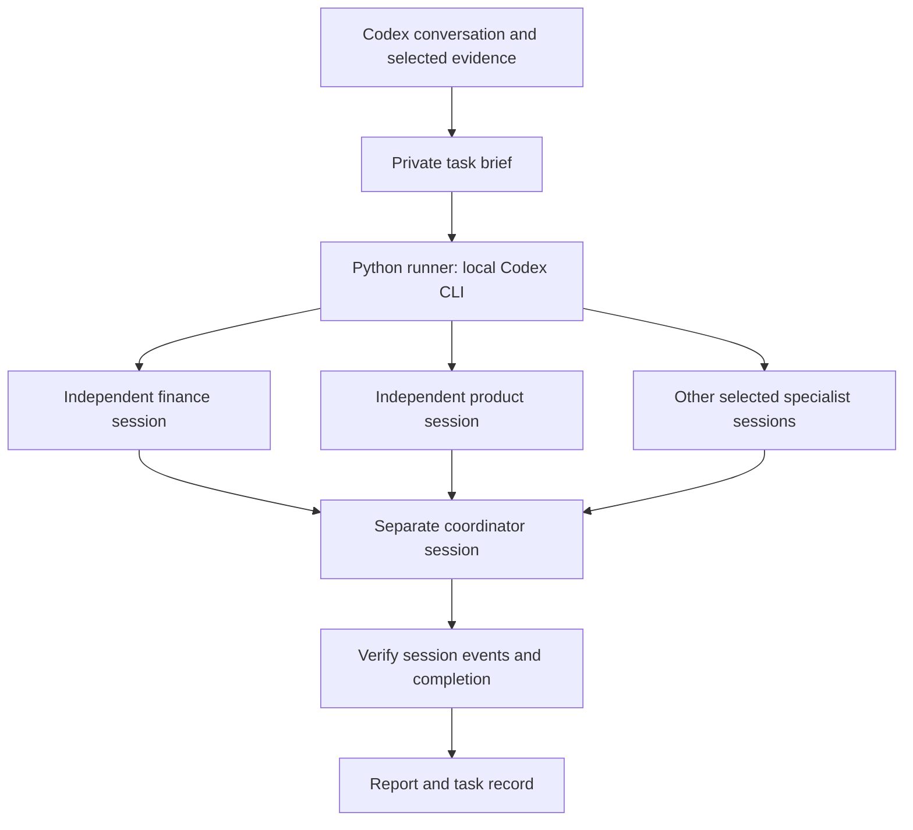

# Open Executive - Codex Council fork

This fork adds an **executive council using your signed-in local Codex CLI**.
Each specialist analyzes a task in its own session, then a separate coordinator
combines their findings into one recommendation. This workflow needs **no
separate model API key, Docker setup, or additional sign-in** when your CLI is
already logged in with ChatGPT.

Based on [SenteLabsAI/OpenExecutive](https://github.com/SenteLabsAI/OpenExecutive).
The original README is preserved unchanged in [README.upstream.md](README.upstream.md).

## What changed

- Added the installable [open-executive-council skill](skills/open-executive-council/SKILL.md).
- Reused the nine upstream specialist prompts: strategy, finance, people, legal,
  operations, marketing, product, sales, and board communications.
- Added a Python runner using only the standard library and the existing Codex
  CLI login. Specialists run one at a time, followed by a coordinator.
- Added verification of distinct CLI session IDs, completed turns, and final
  reports; a failed specialist prevents a successful council result.
- Added a 20-minute timeout, cancellation cleanup, focused tests, and CI checks.
- Replaced this README and archived the upstream version.

**This is a standalone advisory workflow.** It does not replace the model
provider behind the original FastAPI application's `/chat` route. The original
dashboard, database, document retrieval, integrations, and scheduler are available
through the [upstream instructions](README.upstream.md), but are not part of this
council mode.

## Architecture



Specialists receive the same relevant brief in separate contexts. They do not
see each other's initial answers. The coordinator receives their reports and
reconciles disagreements. Workers run serially; this favors simple execution
with the existing login over parallel speed. Model inference remains remote
and consumes your Codex account allowance.

## Run locally

Requires Python 3.10+ and Codex CLI, tested with CLI 0.154.0. From this checkout:

```sh
python skills/open-executive-council/scripts/council.py status
```

If the CLI is already signed in with ChatGPT, you can run immediately. Otherwise
use the normal `codex login` flow once. The runner does not copy or manage login
credentials and removes API-key overrides from its child processes.

Try the included fictional example:

```sh
python skills/open-executive-council/scripts/council.py run --task skills/open-executive-council/examples --output company/council-results/example-1 --roles finance,product
```

The runner finds `codex` on PATH or in the standard Windows desktop installation.
For another location, pass `--codex /absolute/path/to/codex` before `run` or
`status`. See [runtime setup](skills/open-executive-council/references/runtime.md).

For real work, create a private directory containing a UTF-8 `brief.md`, then
pass it with `--task`. Use a fresh output directory for every run. The repository's
`company/` directory is gitignored; keep private briefs and output there or outside
version control. Include only the evidence needed for the task.

A successful council produces:

- `report.md`: the coordinator's final recommendation.
- `result.json`: completion status and actual specialist/coordinator session IDs.
- `<role>/` and `executive/`: individual reports, `events.jsonl`, and `stderr.log`.

If login, inference, or a specialist fails, the runner exits with an error.
After execution starts, it retains diagnostic files and a failed result record.
A final answer that merely claims to have consulted specialists cannot establish
completion: the runner checks each session's recorded events.

## Use from Codex as a skill

Ask Codex to install `skills/open-executive-council` from this repository using
`$skill-installer`. While the PR is open, specify the feature branch
`feat/codex-container-council`; after merging, use `main`.

Then ask, for example:

> Use $open-executive-council to evaluate this launch with finance, product,
> and marketing. Here are our constraints and the evidence we have.

The skill prepares the task brief, invokes the local CLI sessions, and returns
their verified report to the conversation. These sessions have their own IDs;
they are not native child threads of the desktop conversation.

## Boundaries and operation

- This is an advisory workflow. Shell, app, browser, computer-use, image-generation,
  web-search, and further delegation capabilities are disabled for workers.
  Supply current research in the brief when it is needed.
- Workers use a read-only Codex sandbox and a temporary working directory with
  user configuration loading disabled. This workflow has no container isolation.
- Each council has a 20-minute execution limit. Ctrl+C or timeout stops the
  process tree started by that invocation. Cleanup failures are reported.
- Multiple specialist reviews consume more Codex usage than one response.
  Account access, rate limits, internet connectivity, and occasional re-login
  still apply. This is for personal, trusted use, not a public service.
- Reports and diagnostics can contain company information. Keep them private.
- Role prompts and numerical benchmarks are advisory heuristics. The council
  does not independently fetch current facts, maintain cross-task company
  memory, or guarantee a correct business decision.

## Validation

```sh
python -m unittest discover -s skills/open-executive-council/tests -v
```

The `Codex Council` workflow runs unit tests and Python compilation without
credentials or model calls. A live local run of the fictional finance/product
example completed with three distinct session IDs. It correctly calculated
12 months of current runway, 7.5 months after hiring, and 11.9 months after the
small pilot, excluding the uncollected invoice. The recommendation was to run
the pilot and defer the hire. Live model output is not deterministic.

## Provenance and license

Upstream role prompts are from commit
`e30ae89a473d70733f8eab9599f2b41ea922ff77`, extracted without executing upstream
Python code. The wrapper, skill instructions, and tests are this fork's
modifications. See [LICENSE](LICENSE) and [NOTICE](NOTICE) for the original
Apache 2.0 license and attribution.
